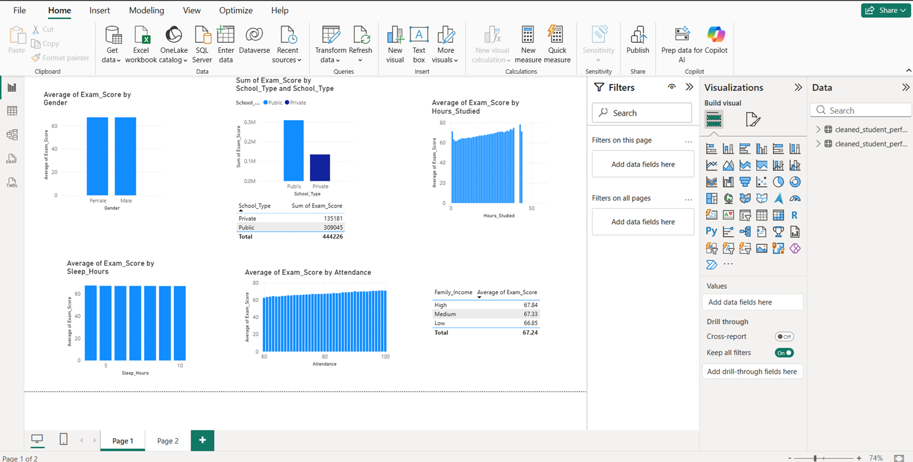

# 📊 Student Performance Dashboard

Power BI dashboard analysis of student performance factors.

---

## 🖼 Dashboard Preview

---

## 📌 Project Overview

This project analyzes student performance using Power BI. It helps identify factors affecting student exam scores through interactive dashboards and visualizations.

---

## 🛠 Tools Used

- Power BI
- Microsoft Excel

---

## 📂 Dataset

- StudentPerformanceFactors.xlsx

---

## 📈 Dashboard Features

- Student Performance Analysis
- Attendance Insights
- Study Hours Analysis
- Sleep Hours Analysis
- Previous Scores Analysis
- Interactive Filters

---

## 👩‍💻 Author

**Jaspreet Kaur**
